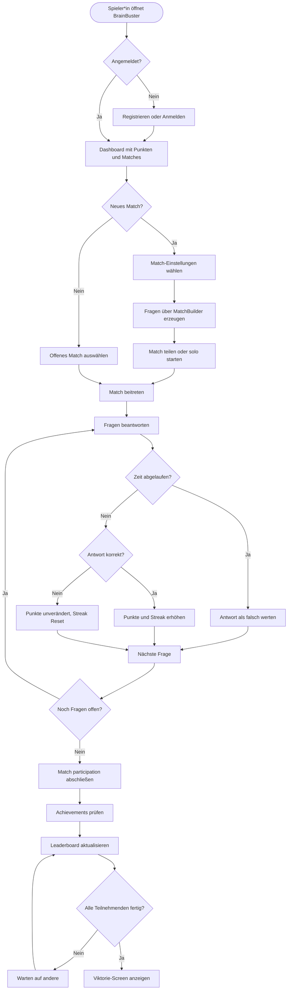

# BrainBuster – Aktivitätsdiagramm

```mermaid
flowchart TD
  A([Spieler*in öffnet BrainBuster]) --> B{Angemeldet?}
  B -- Nein --> C[Registrieren oder Anmelden]
  C --> D
  B -- Ja --> D[Dashboard mit Punkten und Matches]
  D --> E{Neues Match?}
  E -- Ja --> F[Match-Einstellungen wählen]
  F --> G[Fragen über MatchBuilder erzeugen]
  G --> H[Match teilen oder solo starten]
  E -- Nein --> I[Offenes Match auswählen]
  H --> J[Match beitreten]
  I --> J
  J --> K[Fragen beantworten]
  K --> L{Zeit abgelaufen?}
  L -- Ja --> M[Antwort als falsch werten]
  L -- Nein --> N{Antwort korrekt?}
  N -- Ja --> O[Punkte und Streak erhöhen]
  N -- Nein --> P[Punkte unverändert, Streak Reset]
  M --> Q[Nächste Frage]
  O --> Q
  P --> Q
  Q --> R{Noch Fragen offen?}
  R -- Ja --> K
  R -- Nein --> S[Match participation abschließen]
  S --> T[Achievements prüfen]
  T --> U[Leaderboard aktualisieren]
  U --> V{Alle Teilnehmenden fertig?}
  V -- Nein --> W[Warten auf andere]
  V -- Ja --> X[Viktorie-Screen anzeigen]
  W --> U
```

Dieses einfache Diagramm zeigt den typischen Ablauf: vom Start in der App, über Match-Erstellung oder Teilnahme, bis zur Auswertung und dem Victory-Screen.
