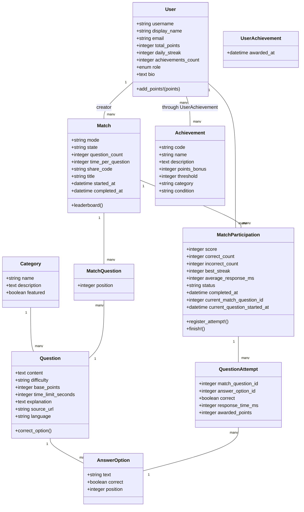

# BrainBuster – Klassendiagramm

```mermaid
classDiagram
  class User {
    +string username
    +string display_name
    +string email
    +integer total_points
    +integer daily_streak
    +integer achievements_count
    +enum role
    +text bio
    +add_points!(points)
  }

  class Category {
    +string name
    +text description
    +boolean featured
  }

  class Question {
    +text content
    +string difficulty
    +integer base_points
    +integer time_limit_seconds
    +text explanation
    +string source_url
    +string language
    +correct_option()
  }

  class AnswerOption {
    +string text
    +boolean correct
    +integer position
  }

  class Match {
    +string mode
    +string state
    +integer question_count
    +integer time_per_question
    +string share_code
    +string title
    +datetime started_at
    +datetime completed_at
    +leaderboard()
  }

  class MatchQuestion {
    +integer position
  }

  class MatchParticipation {
    +integer score
    +integer correct_count
    +integer incorrect_count
    +integer best_streak
    +integer average_response_ms
    +string status
    +datetime completed_at
    +integer current_match_question_id
    +datetime current_question_started_at
    +register_attempt!()
    +finish!()
  }

  class QuestionAttempt {
    +integer match_question_id
    +integer answer_option_id
    +boolean correct
    +integer response_time_ms
    +integer awarded_points
  }

  class Achievement {
    +string code
    +string name
    +text description
    +integer points_bonus
    +integer threshold
    +string category
    +string condition
  }

  class UserAchievement {
    +datetime awarded_at
  }

  User "1" -- "many" MatchParticipation
  User "1" -- "many" Match : creator
  User "many" -- "many" Achievement : through UserAchievement
  Category "1" -- "many" Question
  Question "1" -- "many" AnswerOption
  Match "1" -- "many" MatchQuestion
  MatchQuestion "many" -- "1" Question
  Match "1" -- "many" MatchParticipation
  MatchParticipation "1" -- "many" QuestionAttempt
  QuestionAttempt "many" -- "1" AnswerOption
```

Dieses Diagramm zeigt die wichtigsten Beziehungen der BrainBuster-Domäne. Für eine detaillierte Beschreibung der Services und Spielabläufe siehe `README.md`.
