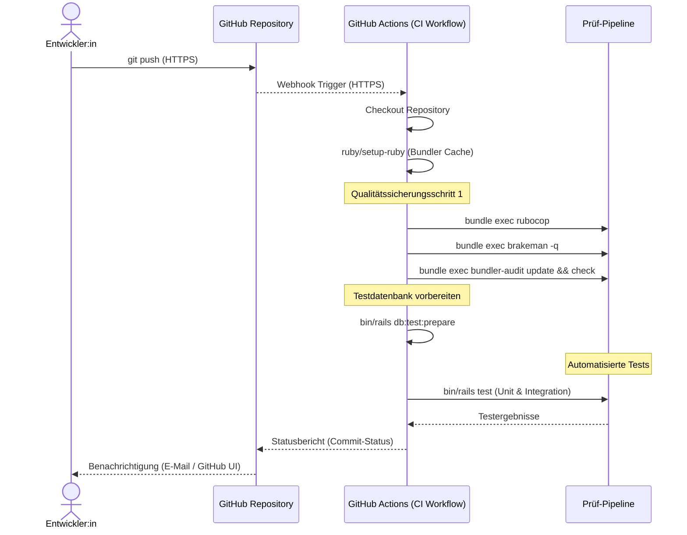

# CI/CD Sequenzdiagramm

- **Kommunikationsprotokolle:** Git-Push über HTTPS, GitHub-Webhooks ebenfalls HTTPS.
- **Qualitätssicherung:** RuboCop (Style), Brakeman (Security), Bundler Audit (Dependencies), sowie automatisierte Rails-Tests.
  RuboCop checkt ob der code den Stil- und QUalitätsregeln entspricht die vordefiniert wurden.
  Brakeman ist ein Sicherheits-Scanner speziell für Ruby on Rails. Er analysiert typische Schwachstellen wie SQL-Injektion oder ungesicherte Formulare. Und warnt vor diesen gefährlichen Stellen bevor man diese deployed.
  Bundler Audit ist ein Frühwarnsystem für externe Bibliotheken (Gems in Ruby genannt). Es zeigt Sicherheitslücken innerhalb dieser Bibliotheken auf.
- **Beteiligte Rollen/Systeme:** Entwickler:in, GitHub-Repository, GitHub Actions als CI-Plattform und die QA-Schritte innerhalb des Workflows.
